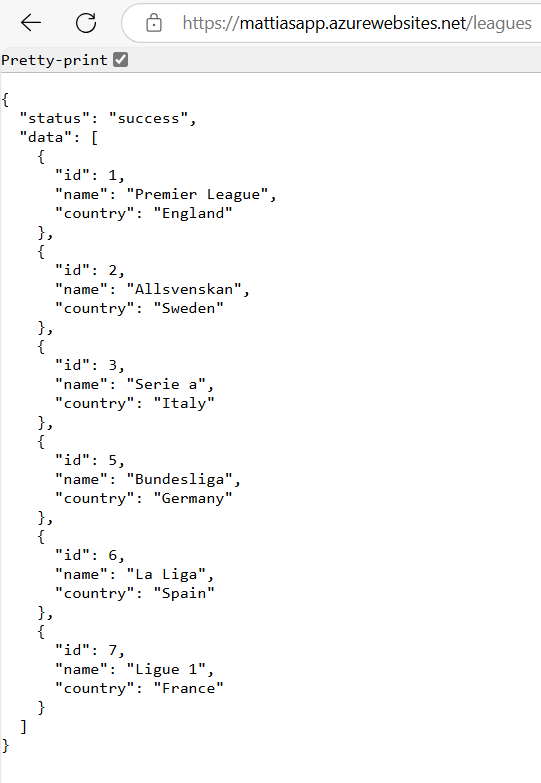
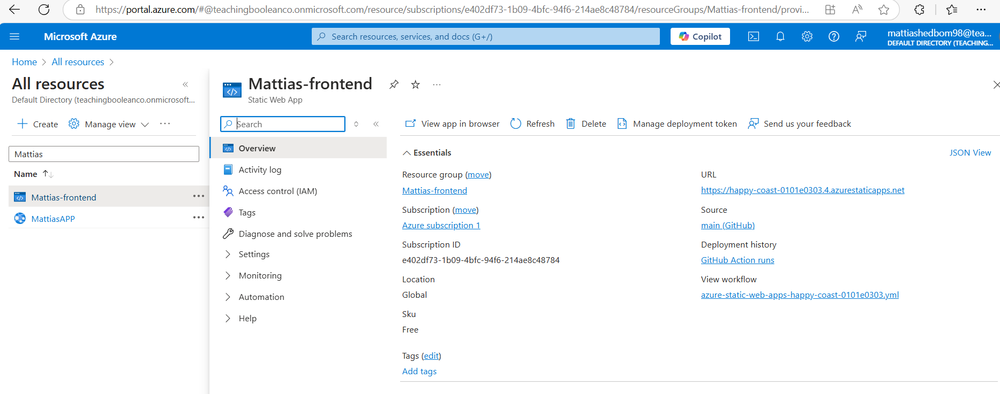
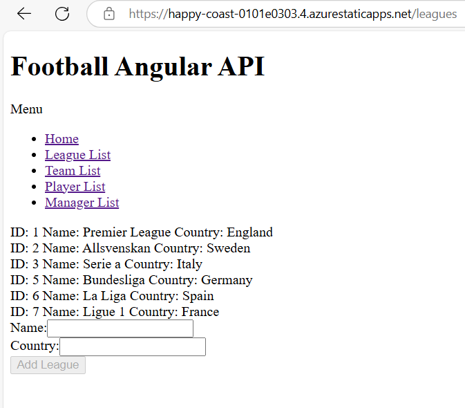

# Screenshots






# Java Cloud - Azure - Day 2

## Learning Objectives

- Deploy a Spring App to Azure Web Services
- Deploy a Spring App with a Database Connection
- Connect a Spring App to an Azure Database
- Add a React App that talks to the Spring App
- Deploy the React App to Azure as well

## Configuring the Spring App

Follow the instructions here: [https://learn.microsoft.com/en-us/azure/app-service/configure-language-java-deploy-run?tabs=linux&pivots=java-javase](https://learn.microsoft.com/en-us/azure/app-service/configure-language-java-deploy-run?tabs=linux&pivots=java-javase) selecting the options for Java SE.

Make sure you run the following in your terminal and log in to the correct Azure account.

```bash
az login
```

Add the following to the `plugins` section at the top of your `build.gradle` file:

```groovy
id 'com.microsoft.azure.azurewebapp' version '1.10.0'
```

The configuration looks something like this (replace all angle bracket parts with actual values) at the bottom of your `build.gradle` file:

```groovy
azurewebapp {
	subscription = '<Insert Subscription Here>'
	resourceGroup = 'students_infrastructure'
	appName = '<App Name Goes Here>'
	pricingTier = 'F1'
	region = 'northeurope'
	appServicePlanName = 'ASP-studentsinfrastructure-a6a0'
	runtime {
		os = 'Linux'
		webContainer = 'Java SE' // or 'Java SE' if you want to run an executable jar
		javaVersion = 'Java 21'
	}
	appSettings {
		alwaysOn = "off"
	}
	auth {
		type = 'azure_cli' // support azure_cli, oauth2, device_code and service_principal
	}
}
```

Then run the following command in the terminal:

```bash
./gradlew azureWebAppDeploy
```

This should deploy the application to Azure.

## Deliverables

The steps to work on today are as follows:

- Deploy a Spring App without a database - the joke machine or the counter app are simple enough.
- Deploy a Spring App that already works that connects to a Neon Database.
- Change the application.yml file to read the database connection details from the Environment Variables section of Azure
- Investigate replacing the Neon Database with an Azure Database (you may need to make sure they both live on the same Network Group)
- Investigate how to deploy a React Frontend to Azure and have it talk to your Backend application
  
### Core

- Deploy your Backend application to Azure but have it using a Neon Database

### Extension

- Deploy a React Frontend for your application to Azure and have the two parts talking to each other
- Make the Backend talk to an Azure postgres database

Screenshot each stage and add them into here so that you can evidence completing the steps necessary

